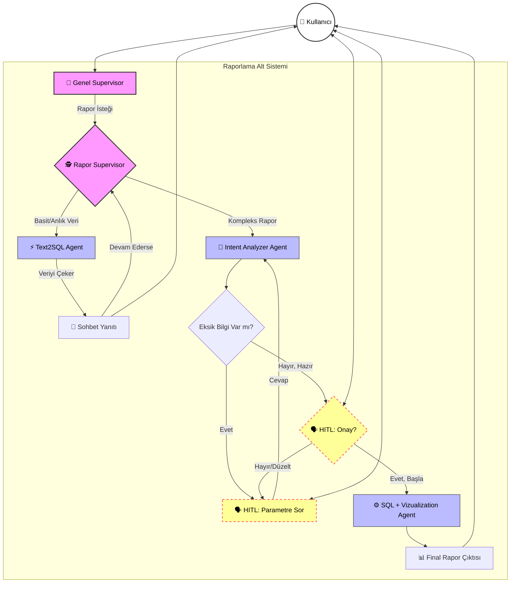

```mermaid
graph TD
    %% Stiller
    classDef supervisor fill:#f9f,stroke:#333,stroke-width:2px,color:black;
    classDef agent fill:#bbf,stroke:#333,stroke-width:1px,color:black;
    classDef hitl fill:#ff9,stroke:#f66,stroke-width:2px,stroke-dasharray: 5 5,color:black;
    classDef user fill:#fff,stroke:#333,stroke-width:2px,color:black;

    User((👤 Kullanıcı)) --> MainSup[👮 Genel Supervisor]
    
    subgraph "Raporlama Alt Sistemi"
        MainSup -->|Rapor İsteği| RepSup{🕵️ Rapor Supervisor}
        
        %% Senaryo 1: Hızlı Cevap
        RepSup -->|Basit/Anlık Veri| QuickSQL[⚡ Text2SQL Agent]
        QuickSQL -->|Veriyi Çeker| QuickResp[💬 Sohbet Yanıtı]
        QuickResp -->|Devam Ederse| RepSup
        
        %% Senaryo 2: Detaylı Rapor
        RepSup -->|Kompleks Rapor| IntAnal[🧠 Intent Analyzer Agent]
        
        IntAnal --> CheckParams{Eksik Bilgi Var mı?}
        CheckParams -- Evet --> AskUser[🗣️ HITL: Parametre Sor]
        AskUser -- Cevap --> IntAnal
        
        CheckParams -- Hayır, Hazır --> Confirm{🗣️ HITL: Onay?}
        Confirm -- Hayır/Düzelt --> AskUser
        Confirm -- Evet, Başla --> Generator[⚙️ SQL + Vizualization Agent]
        
        Generator --> ReportOut[📊 Final Rapor Çıktısı]
    end

    ReportOut --> User
    QuickResp --> User
    AskUser <--> User
    Confirm <--> User

    %% Sınıf Atamaları
    class MainSup,RepSup supervisor;
    class QuickSQL,IntAnal,Generator agent;
    class AskUser,Confirm hitl;
    class User user;
```