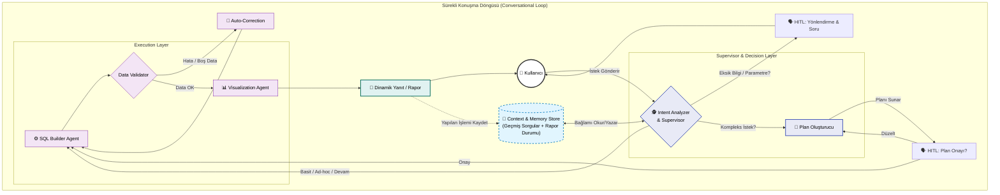

```mermaid
graph TD
    %% Stiller
    classDef user fill:#fff,stroke:#333,stroke-width:3px,color:black,rx:10,ry:10;
    classDef memory fill:#e1f5fe,stroke:#0277bd,stroke-width:2px,color:black,stroke-dasharray: 5 5;
    classDef brain fill:#e8eaf6,stroke:#3f51b5,stroke-width:2px,color:black;
    classDef worker fill:#f3e5f5,stroke:#7b1fa2,stroke-width:1px,color:black;
    classDef output fill:#e0f2f1,stroke:#00695c,stroke-width:2px,color:black;

    %% Ana Aktörler
    User((👤 Kullanıcı)) 
    
    subgraph "Sürekli Konuşma Döngüsü (Conversational Loop)"
        
        %% 1. Hafıza Katmanı (Context)
        Memory[("🧠 Context & Memory Store\n(Geçmiş Sorgular + Rapor Durumu)")]
        
        %% 2. Beyin Takımı (Karar Mekanizması)
        subgraph "Supervisor & Decision Layer"
            Analyzer{🕵️ Intent Analyzer\n& Supervisor}
            Planner[📝 Plan Oluşturucu]
        end

        %% 3. İşçiler (Workers)
        subgraph "Execution Layer"
            SQLBuilder[⚙️ SQL Builder Agent]
            Validator{Data Validator}
            Visualizer[📊 Visualization Agent]
        end

        %% Akışlar
        User -->|İstek Gönderir| Analyzer
        Memory <-->|Bağlamı Okur/Yazar| Analyzer
        
        %% Karar: Bilgi Eksik mi?
        Analyzer -- "Eksik Bilgi / Parametre?" --> AskUser[🗣️ HITL: Yönlendirme & Soru]
        AskUser --> User
        
        %% Karar: Kompleks mi?
        Analyzer -- "Kompleks İstek?" --> Planner
        Planner -->|Planı Sunar| ConfirmPlan[🗣️ HITL: Plan Onayı?]
        ConfirmPlan -- "Düzelt" --> Planner
        ConfirmPlan -- "Onay" --> SQLBuilder
        
        %% Karar: Basit mi? (Devamlılık içeriyorsa hafızadan SQL'i alıp editler)
        Analyzer -- "Basit / Ad-hoc / Devam" --> SQLBuilder
        
        %% SQL İnşa ve Kontrol
        SQLBuilder --> Validator
        Validator -- "Hata / Boş Data" --> SelfRefine[🔄 Auto-Correction]
        SelfRefine --> SQLBuilder
        Validator -- "Data OK" --> Visualizer
        
        %% Çıktı ve Döngü
        Visualizer --> Report[📄 Dinamik Yanıt / Rapor]
    end

    Report --> User
    Report -.->|Yapılan İşlemi Kaydet| Memory

    %% Sınıf Atamaları
    class User user;
    class Memory memory;
    class Analyzer,Planner brain;
    class SQLBuilder,Validator,Visualizer,SelfRefine worker;
    class Report output;
```